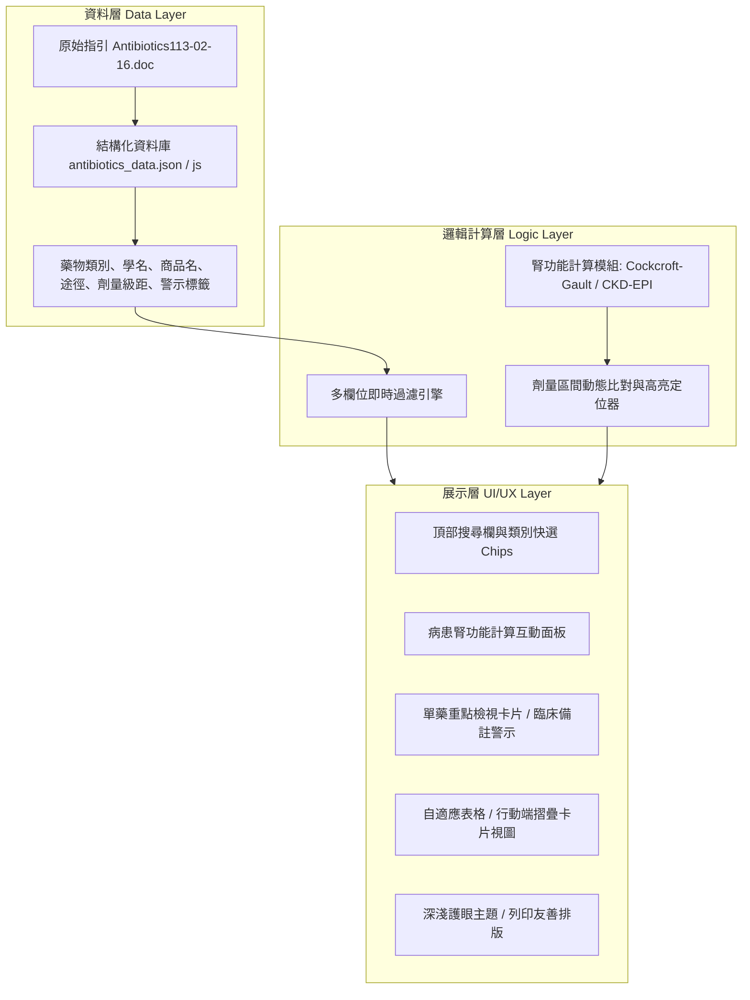

# 臨床抗生素劑量與腎功能調整速查系統 - 專案紀錄 (Project Record)

---

## 1. 專案基本資訊 (Project Overview)

| 項目 | 內容 |
| :--- | :--- |
| **專案名稱** | 臨床抗生素劑量與腎功能調整速查系統 (Clinical Antibiotics Renal Dosing Assistant) |
| **專案代號** | `Antibiotics-Dose-Guide` |
| **建立日期** | 2026-09-15 |
| **基準參考指引** | 院內抗生素使用手冊 (修訂日期：民國 113 年 02 月 16 日 / `Antibiotics113-02-16.doc`) |
| **主要目標使用者** | 臨床醫師、感染科醫師、臨床藥師、護理師、專科護理師 (NP)、臨床實習醫學生與藥學生 |
| **運作環境** | 現代網頁瀏覽器 (Chrome, Edge, Safari, Firefox)、支援行動裝置 (RWD)、純前端離線運作 (Zero-dependency Web App) |

---

## 2. 專案背景與核心目標 (Background & Objectives)

### 2.1 背景說明
抗生素於臨床治療重症與各類感染症時極為關鍵，但絕大多數抗生素需依據病患之腎功能（如 eGFR 或 Creatinine Clearance, CrCl）及透析方式（血液透析 HD、腹膜透析 PD、連續性血液淨化 CRRT 等）進行劑量或給藥間隔調整。
傳統臨床常查閱紙本或長篇 Word/PDF 指引手冊，在急診、ICU、病房等緊湊節奏下，翻查不易、劑量換算耗時，容易增加用藥劑量計算誤差或延誤治療之風險。

### 2.2 核心目標
1. **秒級即時速查**：輸入藥名（學名、商品名、中英文或常用縮寫）即時過濾顯示。
2. **完整劑量分級**：清楚呈現 Stat / Loading dose、常規輕度 (eGFR > 50)、中度 (eGFR 10–50)、重度/透析 (eGFR < 10, HD, PD) 之建議劑量。
3. **整合臨床腎功能計算機**：內建 Cockcroft-Gault 與 CKD-EPI 公式，計算出病人數值後自動高亮 (Highlight) 對應之劑量區間。
4. **安全警示與臨床要點提醒**：清楚提示高風險項目（如神經毒性、耳腎毒性、TDM 血中濃度監測要求、透析後補充劑量）。
5. **單檔可攜與離線可用**：無需複雜後端環境即可在院內內網、病房電腦或個人手機離線流暢運作。

---

## 3. 現有資產盤點與技術現狀 (Existing Assets & Current Status)

### 3.1 現有檔案清單
| 檔案名稱 | 類型 | 檔案大小 | 說明與現狀評估 |
| :--- | :---: | :---: | :--- |
| `Antibiotics113-02-16.doc` | 原始文檔 | 約 575 KB | 基準臨床指引文件（113-02-16 修訂版），為各藥品劑量標準之依據來源。 |
| `抗生素劑量調整.html` | 原型網頁 | 約 27 KB | 單檔 HTML 原型，內嵌 9 大類、共 33 種抗生素資料陣列；具備基礎表格渲染、即時關鍵字搜尋、途徑切換與單藥預覽卡。 |
| `抗生素劑量調整.txt` | 代碼備份 | 約 25 KB | `抗生素劑量調整.html` 之純文字備份檔。 |

### 3.2 現有原型功能與待優化痛點
- **優勢**：
  - 單檔架構，直接開啟即可檢視。
  - 已整理 33 種常用抗生素核心欄位（Stat, >50, 10–50, <10, Notes）。
- **待改進與擴充項目 (Gap Analysis)**：
  1. **資料與程式碼耦合**：目前資料寫死於 HTML `<script>` 內的 JavaScript 陣列中，日後新增或維護藥物容易造成語法損壞，應抽離為標準 JSON 結構或外部獨立資料模組。
  2. **缺少臨床數值計算器**：尚未提供年齡、性別、體重、Scr 輸入之腎功能計算功能，無法一鍵定位病患適用劑量。
  3. **搜尋維度有限**：目前僅匹配單一文字搜尋，未支援學名（Generic name）、商品名（Brand name）、適應症或別名多維度聯想。
  4. **行動裝置體驗**：寬表格在手機垂直螢幕上需左右滑動，需強化行動端響應式卡片 (Responsive Card Layout) 顯示。
  5. **透析分型細緻度**：部分重症藥物於 HD、PD、CRRT (CVVH/CVVHD) 處置差異大，備註欄位需結構化整理。

---

## 4. 系統架構與技術選型 (System Architecture)



### 4.1 技術規範
- **前端技術**：HTML5, CSS3 (現代 CSS 變數 + Flexbox/Grid), 原生 JavaScript (ES6+，維持零第三方依賴、確保極速載入與最大相容性)。
- **部署模式**：
  - **單檔獨立模式 (Standalone HTML)**：方便打包成單一 `.html` 檔案寄送或放置於隨身碟、院內離線電腦直接雙擊使用。
  - **模組化開發模式 (Modular Source)**：將資料 `data/`、樣式 `css/`、邏輯 `js/` 分離，便於版本控制與維護。
- **儲存與快取**：支援 Web Storage (LocalStorage) 保存使用者常用喜好（如預設檢視模式、最後搜尋、計算機預設單位）。

---

## 5. 資料結構規範 (Data Schema Specification)

每筆抗生素資料預計遵循以下 JSON 規範：

```json
{
  "id": "vanco",
  "category": "Glycopeptides & Lipopeptides (糖肽類及抗革蘭氏陽性菌)",
  "genericName": "Vancomycin",
  "brandName": "Vancocin / 萬古黴素",
  "specs": "500mg/vial",
  "route": ["IV"],
  "statLoading": "25–30 mg/kg (重症) 或 500mg–1g (常規，滴注時間 > 1hr)",
  "dosing": {
    "normal": {
      "gfrRange": "> 50 mL/min",
      "dose": "1g Q12H 或 15–20 mg/kg Q8–12H",
      "level": "norm"
    },
    "moderate": {
      "gfrRange": "10–50 mL/min",
      "dose": "1g Q24H (或 1g Q48H，視 CrCl 動態調整)",
      "level": "mod"
    },
    "severe": {
      "gfrRange": "< 10 mL/min",
      "dose": "500mg Q48–72H 或依 TDM 濃度給予",
      "level": "sev"
    },
    "dialysis": {
      "hd": "透析後給予 500mg–1g (隨 HD 結束後補充)",
      "pd": "1g Q5–7D 或腹膜透析液內給藥",
      "crrt": "依 CRRT 流量監測調整"
    }
  },
  "monitoring": {
    "tdm": true,
    "targetTrough": "重症/肺炎/菌血症：15–20 μg/mL；一般感染：10–15 μg/mL",
    "toxicity": ["腎毒性 (Nephrotoxicity)", "紅人症候群 (Red Man Syndrome)", "耳毒性"]
  },
  "notes": "需常規監測 Trough level；快速滴注可能引發組織胺釋放 (Red man syndrome)，每次 1g 至少滴注 60–120 分鐘以上。",
  "tags": ["MRSA", "Gram-Positive", "TDM"]
}
```

---

## 6. 核心功能模組規劃 (Feature Modules)

### 模組 1：智慧搜尋與篩選 (Smart Search & Filtering)
- **模糊搜尋 (Fuzzy Match)**：支援藥品學名、商品名、中英別名、代號（如 `vanco`, `curam`, `tapi`, `cefepime`, `立汎黴素`）。
- **給藥途徑過濾 (Route Filtering)**：IV (針劑)、PO (口服)、Inh (吸入劑)。
- **類別篩選 (Category Tabs/Chips)**：快速切換 Penicillins, Cephalosporins, Carbapenems, Fluoroquinolones 等各大類。

### 模組 2：臨床腎功能即時計算機 (Renal Function Calculator)
- **Cockcroft-Gault 公式 (CrCl)**：
  $$\text{CrCl (男)} = \frac{(140 - \text{年齡}) \times \text{體重 (kg)}}{72 \times \text{血清肌酸酐 Scr (mg/dL)}}$$
  $$\text{CrCl (女)} = \text{CrCl (男)} \times 0.85$$
- **理想體重 (IBW) 修正選項**：病患體重過重或肥胖時提供 Adjusted Body Weight (ABW) 換算切換。
- **動態聯動標記**：當輸入病人 Scr 換算出數值（例如 28 mL/min），系統即自動在所有藥品表格中將「中度 (10–50)」欄位高亮標記，減少視覺比對負擔。

### 模組 3：高風險與臨床注意事項標記 (Clinical Safety Badges)
- **毒性與監測警示**：以不同色系 Badge 標明（紅色：需 TDM 血中濃度監測；橘色：具神經毒性或蓄積風險；藍色：透析後需額外補給劑量）。
- **免調整標籤**：主要由肝臟代謝（如 Ceftriaxone, Oxacillin, Moxifloxacin, Tigecycline），標註「肝臟代謝／不需依腎功能調整」，避免臨床過度減量導致療效不足。

### 模組 4：雙視圖切換與行動體驗 (Responsive UI / View Switching)
- **完整表格視圖 (Desktop Table View)**：適合護理站大螢幕、病房工作台電腦。
- **行動卡片視圖 (Mobile Card View)**：適合查房手機瀏覽，直式排列劑量階層與按鈕展開。
- **列印友善模式 (Print Mode)**：針對特定抗生素或全分類產生乾淨、無工具列的列印格式。

---

## 7. 專案開發時程與里程碑 (Roadmap & Milestones)

| 階段 | 里程碑目標 | 主要任務 | 狀態 |
| :---: | :--- | :--- | :---: |
| **Phase 1** | **專案建立與資料盤點** | • 建立專案紀錄 (`PROJECT_RECORD.md`) 與說明文件 (`README.md`)<br>• 解析現有資產與 33 筆藥品資料完整性 | **已完成 (當前)** |
| **Phase 2** | **資料結構化與模組抽離** | • 將藥品資料標準化為獨立 JSON/JS 模組 (`antibiotics_data.js`)<br>• 擴充與校驗學名、商品名、中英別名與 TDM 監測標準 | **待進行** |
| **Phase 3** | **腎功能計算機與動態聯動** | • 實作 Cockcroft-Gault CrCl 與 eGFR 即時計算機<br>• 實作即時計算結果與藥品劑量級距的高亮連動 | **待進行** |
| **Phase 4** | **UI/UX 現代化與行動端優化** | • 升級現代化清爽醫療介面 (RWD、卡片式/表格切換、護眼配色)<br>• 新增快速複製劑量處方文字功能 (便於臨床貼入醫囑或紀錄) | **待進行** |
| **Phase 5** | **離線支援、驗證與交付** | • 整合為單檔發行版與模組版雙軌發布<br>• 跨瀏覽器與各尺寸螢幕檢驗，臨床數據最終校對確認 | **待進行** |

---

## 8. 醫療免責聲明與校對指針 (Clinical Disclaimer & Review Guideline)

> [!WARNING]
> **臨床使用注意事項 (Disclaimer)**：
> 1. 本系統僅供臨床醫護專業人員參考與教學輔助之用，非唯一決策依據。
> 2. 實際臨床用藥應考量病患整體臨床狀況（如感染嚴重度、敗血性休克、容積過負荷、肝腎合併衰竭、肥胖等）及各院區最新抗生素委員會/藥委會指引。
> 3. 特殊族群（如重度敗血症初始復甦階段）常需給予常規全額 Loading Dose，切勿因腎功能不良而延誤或縮減首劑劑量。

---

## 9. 變更紀錄 (Changelog)

- **v0.4.1 (2026-09-16)**:
  - **單位顯示微調**：依使用者回饋將 eGFR 單位由 `mL/min/1.73^2` 優化修訂為標準格式 **`mL/min/1.73m2`**。
  - **藥名別名擴充 (Ceftriaxone = Cefin)**：
    - 將第三代頭孢菌素 **Ceftriaxone** 正式增列常見院內商品名 **Cefin (賽芬)**，命名更新為 `Ceftriaxone / Cefin / Sintrix 500mg (3rd gen)`。
    - 支援直接輸入 `Cefin` 或 `Ceftriaxone` 快速聯想過濾。

- **v0.4.0 (2026-09-16)**:
  - **版面比例優化與獨立滾動 (Fixed Top + Scrollable Table)**：
    - 將「抗生素品項」以上區塊（Banner、搜尋工具列、單藥卡片、狀態欄）大幅緊湊化收合，提升下方表格可視面積逾 50%。
    - 上方區塊固定不動 (`flex-shrink: 0`)，下方表格容器獨立啟用垂直滾動 (`overflow-y: auto`)。
    - 表格欄位表頭啟用 `position: sticky; top: 0`，向下捲動瀏覽時表頭永久釘選置頂。
  - **選定藥物即時單一聚焦 (Selected Drug Isolation)**：
    - 下拉選單選定或點擊表格品項後，下方表格**僅留取呈現該選定藥物**，免除於全列表中翻找之負擔。
    - 點選「↺ 顯示全部」即可一鍵還原完整藥品清單。
  - **新增藥物分類下拉式選單 (Category Filter Dropdown)**：
    - 工具列新增 9 大類抗生素分類快選，支援即時過濾表格及聯動收窄藥物品項下拉選單。
  - **eGFR 單位標準化與大小寫修正**：
    - 全面將腎功能單位由 `mL/min` 升級修訂為 `mL/min/1.73^2`。
    - 移除上方單藥卡片之強迫大寫 (`text-transform: uppercase`)，規範顯示為 `Stat / Loading Dose`、`eGFR > 50 mL/min/1.73^2`。
  - **Daptomycin 劑量調整**：
    - 依臨床醫囑修訂 **Daptomycin (Cubicin)** 常規劑量為 **6–10 mg/kg**（重症菌血症/心內膜炎 8–10 mg/kg，洗腎維持 6–10 mg/kg Q48H）。

- **v0.3.0 (2026-09-16)**:
  - **新增品項 - Daptomycin 500mg (Cubicin / 達托黴素)**：
    - 常規劑量 4–6 mg/kg QD，洗腎病患 Q48H 給藥。
    - 臨床監測：每 3–5 天追蹤 Blood Culture (B/C)；每 7 天監測 CPK。
    - 重要禁忌：不可用於治療肺炎。
  - **新增品項 - Xocova 125mg (Ensitrelvir / 恩賽特韋)**：
    - COVID-19 口服 3CL 蛋白酶抑制劑，Day 1 給 375mg，Day 2–5 給 125mg QD。
  - **搜尋與下拉選單雙向同步互動 (Bidirectional Sync)**：
    - 表格點選互動、搜尋即時過濾、A–Z 下拉排序。
    - 新增「↺ 顯示全部」重置按鈕與單藥卡片關閉按鈕。
    - 正則表達式跳脫防護 `escapeRegExp`。

- **v0.2.0 (2026-09-16)**:
  - 建立還原備份標籤：`v0.1.0-before-notes-enrichment`（隨時可無損還原至初始狀態）。
  - 全面豐富 33 種抗生素臨床備註（補齊空白備註，加入神經毒性、黑框警示、透析洗出率與補充時機、滴注時間、金屬離子螯合等臨床重點）。
  - 依臨床指引圖表更新 **Zavicefta 2g/0.5g**：加入標準調配法、100mL 輸注 120 分鐘規範，及腎功能減量專用抽取體積（抽 6.0 mL = 1000/250mg、抽 4.5 mL = 750/187.5mg）。
  - 新增抗病毒藥物 **Veklury 100mg (Remdesivir / 瑞德西韋) [院內碼: VEKI99]**：收錄完整 Day 1–5 劑量階層、IV Pump 輸注速率（75mL/hr 與 150mL/hr）及 Dexamethasone/Pane 共處方指引。
  - 品項總數由 33 種擴充至 34 種。

- **v0.1.0 (2026-09-15)**:
  - 專案正式建立。
  - 完成現有代碼 `抗生素劑量調整.html` 與原始文檔盤點。
  - 完成 `PROJECT_RECORD.md` 規格書與專案紀錄初版編製。
  - 完成 `index.html` 建立（符合 GitHub Pages 預設首頁規範，開箱即用）。
  - 配置 `.gitignore` 排除 Office 暫存檔、Windows 縮圖與臨時日誌。
  - 完成 Git 本地初始化與初始版本提交 (`main` 分支)。
  - 成功推送至遠端倉庫：`https://github.com/DAIDAI082340/MEDICAL-TOOL-ANTIBIOTICS-DOSE.git`。
  - 成功透過 GitHub Pages API 自動啟用並完成部署，正式上線運作。
  - 線上速查系統網址：`https://daidai082340.github.io/MEDICAL-TOOL-ANTIBIOTICS-DOSE/`。
